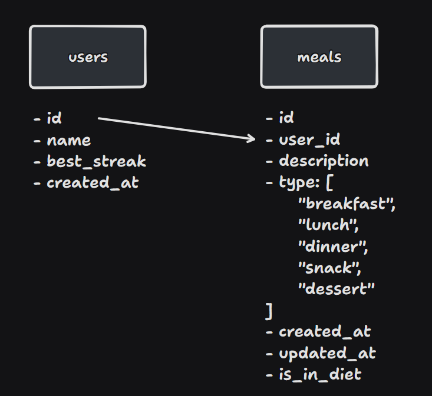

# Daily Diet API

Daily Diet é um desafio da [@Rocketseat](https://rocketseat.com.br/) para implementar o back-end de uma aplicação de registro de refeições, onde o usuário pode marcar o que consumiu durante o dia e seu compromisso com a dieta.

  
  

## Requisitos funcionais

- [x] Deve ser possível criar um usuário;
- [x] Deve ser possível identificar o usuário entre as requisições;
- [x] Deve ser possível registrar uma refeição feita, com as seguintes informações:
  - Tipo (Café da manhã, almoço, jantar, lanche ou sobremesa);
  - Descrição;
  - Data e hora;
  - Está dentro ou não da dieta.
- [x] Deve ser possível editar uma refeição, podendo alterar todos os dados acima;
- [x] Deve ser possível apagar uma refeição;
- [x] Deve ser possível listar todas as refeições de um usuário;
- [x] Deve ser possível visualizar uma única refeição;
- [x] Deve ser possível recuperar as métricas de um usuário:
  - [x] Quantidade total de refeições registradas;
  - [x] Quantidade total de refeições dentro da dieta;
  - [x] Quantidade total de refeições fora da dieta;
  - [x] Melhor sequência de refeições dentro da dieta;

## Regras de negócio

- [x] O usuário só pode visualizar, editar e apagar as refeições o qual ele criou;

## Database

## Rotas

### Manipulação de usuários

- `GET - /users`: Lista todos os usuários;
- `GET - /users/:id/meals`: Recupera as refeições de um usuário;
- `POST - /users`: Cria um usuário com os dados informados no corpo da requisição;

### Manipulação da refeições

- `GET - /meals`: Lista todas as refeições;
- `GET - /meals/:id`: Recupera uma única refeição;
- `PUT - /meals/:id`: Edita uma refeição com os dados informados no corpo da requisição;
- `POST - /meals`: Cria uma refeição com os dados informados no corpo da requisição;
- `DELETE - /meals/:id`: Deleta uma refeição;

### Dados selecionados

- `GET - /users/:userId/meals/count`: Quantidade total de refeições registradas pelo usuário;
- `GET - /users/:userId/meals/in-diet`: Quantidade total de refeições dentro da dieta;
- `GET - /users/:userId/meals/not-in-diet`: Quantidade total de refeições fora da dieta;
- `GET - /users/:userId/best-streak`: Melhor sequência de refeições dentro da dieta;

## Licença

GNU GPLv3 by [Wolney Oliveira](https://github.com/wolney-fo)